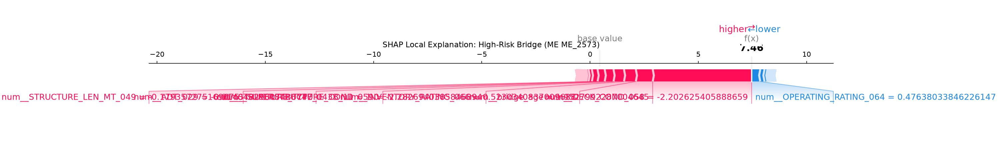
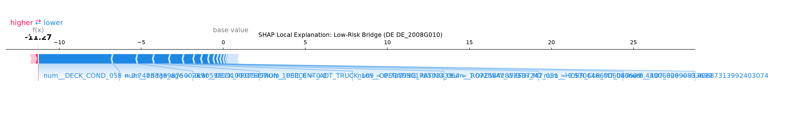

<div align="center">

# Divyansh Kumar Singh (DKS)

### CFD & Hydraulics · Sediment Transport · Water Resources · Stochastic Hydrology · Bridge Infrastructure ML

📍 IIT Kanpur, Kanpur, UP, India &nbsp;|&nbsp; 📧 divyansh179@gmail.com

[](https://github.com/DKS-MANAGER)
[](https://www.linkedin.com/in/divyansh-kumar-singh-92bb621b6)

</div>

---

# Explainable XGBoost for One-Year-Ahead Bridge Condition Prediction and Maintenance Prioritization

<div align="center">


</div>

## Civil-Engineering Problem
Bridge decks deteriorate over time due to traffic, weather, and age. Inspectors rate deck condition on a 0–9 scale, but predicting which bridges will become poor *next year* helps agencies prioritize limited maintenance funds.

## Research Question
Using National Bridge Inventory (NBI) inspection data from 2023, 2024, and 2025 for one U.S. state, can we predict whether a bridge deck will be in poor condition (rating ≤ 4) in year *t*+1 using only information available in year *t*?

## Data Source
- **Official FHWA NBI ASCII files:** https://www.fhwa.dot.gov/bridge/nbi.cfm
- **2023 data:** https://www.fhwa.dot.gov/bridge/nbi/ascii2023.cfm
- **2024 data:** https://www.fhwa.dot.gov/bridge/nbi/ascii2024.cfm
- **2025 data:** https://www.fhwa.dot.gov/bridge/nbi/ascii2025.cfm
- **Format reference:** https://www.fhwa.dot.gov/bridge/nbi/format.cfm
- **Condition-rating reference:** https://www.fhwa.dot.gov/bridge/britab.cfm

## Selected State
**Maine (State Code: 23)**

## Number of Records Per Year
| Year | Records |
|------|---------|
| 2023 | 2,521 |
| 2024 | 2,518 |
| 2025 | 2,542 |

Bridges matched across all three years: **2,509**

## Data Cleaning Process
1. Downloaded official FHWA delimited files for Maine.
2. Standardized column names to FHWA field names (e.g., `DECK_COND_058`).
3. Stripped whitespace from bridge identifiers.
4. Converted NBI missing-value codes (`N`, blank) to `NaN`.
5. Removed duplicate bridge IDs (none found).
6. Matched bridges across years using `STATE_CODE_001 + STRUCTURE_NUMBER_008`.

## Feature List
- `bridge_age` = inspection_year - year_built
- `current_deck_condition` (Item 58)
- `current_superstructure_condition` (Item 59)
- `current_substructure_condition` (Item 60)
- `average_daily_traffic` (ADT_029)
- `average_daily_truck_traffic` (PERCENT_ADT_TRUCK_109)
- `bridge_length` (STRUCTURE_LEN_MT_049)
- `maximum_span_length` (MAX_SPAN_LEN_MT_048)
- `deck_width` (DECK_WIDTH_MT_052)
- `number_of_spans` (MAIN_UNIT_SPANS_045)
- `structure_type` (STRUCTURE_TYPE_043B)
- `structure_material` (STRUCTURE_KIND_043A)
- `scour_criticality` (SCOUR_CRITICAL_113)
- `waterway condition` (WATERWAY_EVAL_071)
- `inspection_year`

## Target Definition
`target_deck_poor_next_year = 1` if the bridge deck condition rating in year *t*+1 is **≤ 4** (Poor).  
`target_deck_poor_next_year = 0` if the rating is **> 4** (Fair or Good).

This follows the FHWA Poor condition threshold used in national bridge performance measures.

## Training/Testing Split
- **Training:** Features from 2023 → Target from 2024 (2,509 bridges)
- **Testing:** Features from 2024 → Target from 2025 (2,509 bridges)

No random row splitting is used for the main experiment.

## Models Used
1. **Majority-class baseline** (predicts the most common class)
2. **Logistic Regression** (simple linear model)
3. **Random Forest** (ensemble of decision trees)
4. **XGBoost Classifier** (gradient-boosted trees, main model)

## Model Performance (2024→2025 Test Data)

| Model | Accuracy | Precision | Recall | F1 | ROC-AUC | PR-AUC | False Negatives | FNR |
|:---|:---|:---|:---|:---|:---|:---|:---|:---|
| Majority Baseline | 0.908 | 0.000 | 0.000 | 0.000 | 0.500 | 0.092 | 230 | 100.0% |
| Logistic Regression | 0.886 | 0.442 | 0.930 | 0.599 | 0.963 | 0.742 | 16 | 7.0% |
| Random Forest | 0.978 | 0.854 | 0.917 | 0.885 | 0.980 | 0.846 | 19 | 8.3% |
| **XGBoost** (threshold=0.846) | **0.981** | **0.882** | **0.913** | **0.897** | **0.983** | **0.854** | **20** | **8.7%** |

> **Note:** XGBoost threshold was selected to prioritize recall (≥80% on training data). False Negative Rate (FNR) is the critical safety metric — it measures bridges the model missed that became poor in 2025.

## Key Visualizations

All plots below are generated by the pipeline (`evaluate_models.py`, `explain_model.py`, `prioritize_bridges.py`) and are stored in `figures/`.

### 📈 1. Discrimination Performance — ROC & Precision-Recall

<table>
<tr>
<td width="50%">

**ROC Curve** — ROC-AUC up to **0.983** (XGBoost)


</td>
<td width="50%">

**Precision-Recall Curve** — PR-AUC up to **0.854** (XGBoost)


</td>
</tr>
</table>

> PR-AUC is the more informative curve here because only **9.2%** of bridges are positive (Poor) — ROC-AUC alone can look deceptively high under class imbalance.

### 🎯 2. Classification Outcome — Confusion Matrix (XGBoost, threshold = 0.846)

<table>
<tr>
<td width="55%">


</td>
<td width="45%">

| | Predicted: Not Poor | Predicted: Poor |
|---|---|---|
| **Actual: Not Poor** | TN = 2,251 | FP = 28 |
| **Actual: Poor** | FN = 20 | TP = 210 |

Out of 230 bridges that actually became **Poor** in 2025, the model correctly flagged **210 (91.3%)** and missed **20 (8.7% FNR)**.

</td>
</tr>
</table>

### 🔍 3. Global Explainability — SHAP Feature Importance

<table>
<tr>
<td width="50%">

**Mean |SHAP| Ranking**


</td>
<td width="50%">

**SHAP Summary (Distribution & Direction)**


</td>
</tr>
</table>

Top drivers: current `DECK_COND_058`, `bridge_age`, `OPERATING_RATING_064`, `DECK_WIDTH_MT_052`, `ADT_029`, `SUBSTRUCTURE_COND_060` — see `reports/shap_feature_importance.csv` for the full ranking.

### 🧩 4. Local Explainability — Individual Bridge Predictions

<table>
<tr>
<td width="50%">

**High-Risk Bridge Explanation**


</td>
<td width="50%">

**Low-Risk Bridge Explanation**


</td>
</tr>
</table>

These waterfall-style plots show exactly which features pushed an *individual* bridge's predicted probability up (red) or down (blue) — answering "why did the model flag *this* bridge?"

### 🏗️ 5. Maintenance Prioritization Outputs (2025 Test Set)

<table>
<tr>
<td width="50%">

**Predicted Risk Distribution by Priority Class**


</td>
<td width="50%">

**Top 20 Maintenance Priority Bridges**


</td>
</tr>
</table>

Full ranking of all 2,509 bridges: `reports/maintenance_priority_2025.csv`.

## Evaluation Metrics
- **Accuracy:** Overall correctness
- **Precision:** Of bridges predicted poor, how many actually became poor?
- **Recall:** Of bridges that became poor, how many did we catch?
- **F1-score:** Balance of precision and recall
- **ROC-AUC:** Ability to discriminate poor vs. non-poor bridges
- **PR-AUC:** Performance on the imbalanced positive class
- **Balanced accuracy:** Accuracy adjusted for class imbalance
- **False-negative count & rate:** Bridges missed by the model (critical for safety)

## SHAP Explanation
SHAP (SHapley Additive exPlanations) shows how each feature pushed the model's prediction up or down for individual bridges. It does **not** prove physical causation; it explains the model's learned pattern.

## Maintenance-Priority Method
Bridges are ranked using a transparent score:

```
priority_score = predicted_probability × condition_severity_multiplier × traffic_multiplier × scour_multiplier
```

Multipliers are defined in `configs/priority_config.yaml`. Priority classes are resource-allocation categories, not failure thresholds:
- **High:** Top 10%
- **Medium:** Next 20%
- **Low:** Remaining 70%

## 📊 Results at a Glance

### What We Did
1. Downloaded 3 years (2023, 2024, 2025) of official FHWA NBI data for Maine.
2. Cleaned, matched, and chronologically split the data (2023→2024 train, 2024→2025 test) with zero data leakage.
3. Trained 4 models — Majority Baseline, Logistic Regression, Random Forest, and XGBoost.
4. Evaluated all models on a **true out-of-time** test set (2,509 bridges never seen during training).
5. Explained the winning model (XGBoost) with SHAP at both global and individual-bridge level.
6. Converted predictions into a transparent, ranked maintenance-priority list.

### Headline Result

| Metric | Majority Baseline | Logistic Regression | Random Forest | **XGBoost (winner)** |
|:---|:---:|:---:|:---:|:---:|
| Accuracy | 0.908 | 0.886 | 0.978 | **0.981** |
| Precision | 0.000 | 0.442 | 0.854 | **0.882** |
| Recall | 0.000 | 0.930 | 0.917 | **0.913** |
| F1-score | 0.000 | 0.599 | 0.885 | **0.897** |
| ROC-AUC | 0.500 | 0.963 | 0.980 | **0.983** |
| PR-AUC | 0.092 | 0.742 | 0.846 | **0.854** |
| Balanced Accuracy | 0.500 | 0.907 | 0.954 | **0.960** |
| False Negatives (of 230) | 230 | 16 | 19 | **20** |

*Source: `reports/model_metrics.csv`, `reports/confusion_matrices.csv`*

### Confusion Matrix — All Models (2024→2025 Test, 2,509 bridges)

| Model | TN | FP | FN | TP |
|---|---:|---:|---:|---:|
| Logistic Regression | 2,009 | 270 | 16 | 214 |
| Random Forest | 2,243 | 36 | 19 | 211 |
| **XGBoost** | **2,251** | **28** | **20** | **210** |

### Top SHAP Feature Drivers (What Explains a "Poor" Prediction)

| Rank | Feature | Interpretation |
|:---:|---|---|
| 1 | `DECK_COND_058` (current deck condition) | Strongest predictor — decks already declining are most likely to cross into Poor |
| 2 | `bridge_age` | Older bridges deteriorate faster |
| 3 | `OPERATING_RATING_064` | Lower load capacity correlates with structural decline |
| 4 | `DECK_WIDTH_MT_052` | Wider decks show different stress/wear patterns |
| 5 | `ADT_029` (average daily traffic) | Higher traffic accelerates deterioration |
| 6 | `SUBSTRUCTURE_COND_060` | Substructure issues signal broader structural decline |

*Full ranking (109 features): `reports/shap_feature_importance.csv`*

### Maintenance Priority Breakdown (2025, 2,509 bridges)

| Priority Class | Count | Percentage | Meaning |
|---|---:|---:|---|
| 🔴 High | 251 | 10.0% | Top 10% — recommend inspection/repair first |
| 🟠 Medium | 502 | 20.0% | Next 20% — monitor closely |
| 🟢 Low | 1,756 | 70.0% | Remaining — routine schedule |

The single highest-priority bridge in 2025 is **`23_2629`** — predicted 99.98% probability of becoming Poor, current deck condition 4, ADT 13,721, scour criticality 8 (source: `reports/maintenance_priority_2025.csv`).

## Limitations
See `docs/limitations.md`.

## Future Work: Production Readiness

This project is a **research prototype** designed for academic demonstration. The following steps would be required to transition it to a production system used by a state DOT or bridge management agency:

### 1. Data Pipeline & Automation
- **Automated data ingestion:** Scheduled downloads of annual NBI data with schema validation and anomaly detection (e.g., sudden drops in bridge counts, new condition codes).
- **Data quality monitoring:** Dashboards tracking missing-value rates, duplicate records, and ID-matching success across years.
- **Versioned data lake:** Store raw and processed data in a versioned format (e.g., Delta Lake, Iceberg) with data contracts and schema evolution tracking.

### 2. Model Robustness & Validation
- **Temporal cross-validation:** Implement rolling-origin CV (train on 2023→test 2024, train on 2023+2024→test 2025) to estimate out-of-time performance stability.
- **Uncertainty quantification:** Add bootstrap confidence intervals, prediction intervals, or Bayesian neural network alternatives so decision-makers understand risk margins.
- **Probability calibration:** Apply Platt scaling or isotonic regression and report calibration error (ECE, MCE) to ensure predicted probabilities match empirical frequencies.
- **Spatial validation:** Evaluate performance by county, route type, and climate zone to detect geographic bias.

### 3. Model Architecture Enhancements
- **Multi-state training:** Extend beyond Maine to 5–10 diverse states (different climates, traffic volumes, bridge inventories) to improve generalization.
- **Temporal models:** Incorporate LSTM or Transformer architectures to capture multi-year deterioration sequences, not just single-year snapshots.
- **Physics-informed constraints:** Enforce physical bounds on deterioration rates (e.g., a bridge cannot drop from condition 9 to ≤4 in one year without catastrophic event flags).
- **Ensemble methods:** Combine XGBoost with survival analysis (Cox proportional hazards, random survival forests) to predict time-to-poor-condition rather than binary one-year-ahead classification.

### 4. Feature Engineering & Data Enrichment
- **Environmental data:** Integrate freeze-thaw cycle counts, precipitation, salinity (coastal corrosion), and temperature extremes from NOAA or PRISM datasets.
- **Maintenance history:** Link to state DOT work-order databases to distinguish "natural deterioration" from "post-maintenance jumps" in condition.
- **Traffic loading spectra:** Replace scalar ADT with WIM (Weigh-In-Motion) data for actual load spectra and fatigue accumulation.
- **Material-specific models:** Train separate models for concrete, steel, and timber bridges, as deterioration mechanisms differ fundamentally.

### 5. Explainability & Civil Engineering Validation
- **Domain expert validation:** Present SHAP explanations to certified bridge inspectors and ask whether the model's "reasons" align with engineering judgment.
- **Counterfactual analysis:** Generate "what-if" scenarios (e.g., "If this bridge were 10 years younger, its predicted probability drops from 78% to 32%").
- **Failure mode attribution:** Link SHAP features to specific deterioration mechanisms (corrosion, fatigue, delamination, scour) rather than generic NBI codes.

### 6. Maintenance Decision Support
- **Cost-benefit optimization:** Replace heuristic priority multipliers with a constrained optimization model that maximizes "years of service restored per dollar" under budget constraints.
- **Remaining service life (RSL) integration:** Calibrate model outputs against existing RSL estimates from state BMS software.
- **Multi-criteria decision analysis:** Incorporate agency priorities (political, economic, social) via Analytic Hierarchy Process (AHP) or PROMETHEE methods.
- **Interactive dashboard:** Deploy a web interface (Streamlit, Plotly Dash) allowing inspectors to query bridges, adjust thresholds, and simulate budget scenarios.

### 7. Deployment & Governance
- **CI/CD for ML:** Automated retraining pipelines triggered when new inspection data arrives (annual or bi-annual).
- **Model monitoring:** Track prediction drift, feature drift, and performance degradation over time. Alert when model accuracy drops below acceptable thresholds.
- **Human-in-the-loop:** Design workflow where model high-priority flags are reviewed by inspectors before entering the official maintenance backlog.
- **Audit trail:** Log every prediction, feature value, and SHAP explanation for regulatory compliance and liability protection.

### 8. Regulatory & Standards Compliance
- **FHWA compliance:** Align with 23 CFR 490 Subpart D performance measures and emerging SNBI (Specifications for the NBI) data standards.
- **State BMS integration:** Export results in formats compatible with existing Bridge Management Systems (e.g., AASHTOWare BrM, Pontis).
- **Documentation standards:** Produce a formal Engineering Analysis Report following state DOT documentation guidelines.

## Current Project Status
This prototype demonstrates feasibility and methodology. It is **not** intended for direct maintenance decision-making without the validation, calibration, and governance steps outlined above.

## ✅ Conclusion

**Research question, answered:** Yes — using only year-*t* NBI inspection data, XGBoost predicted whether a Maine bridge deck would fall into Poor condition (rating ≤ 4) in year *t*+1 with **98.1% accuracy**, **0.983 ROC-AUC**, and **0.854 PR-AUC** on a strictly chronological, leakage-free test set of 2,509 bridges — catching **210 of 230 (91.3%)** bridges that actually became Poor in 2025, while missing only 20 (8.7% false-negative rate).

**Key takeaways:**
1. **The added complexity of XGBoost is justified.** It outperformed the simpler Logistic Regression baseline on every ranking metric (PR-AUC 0.854 vs. 0.742) and edged out Random Forest, particularly on precision (0.882 vs. 0.854) — i.e., fewer false alarms for the same recall.
2. **SHAP explanations align with engineering intuition.** The model's top predictors — current deck condition, bridge age, load rating, traffic volume, and substructure condition — are exactly the factors a civil engineer would expect to drive deterioration, which builds confidence that the model learned real signal rather than spurious correlations.
3. **The output is directly actionable.** The maintenance-priority ranking (`reports/maintenance_priority_2025.csv`, visualized in `figures/top20_priority.png`) turns raw probabilities into a resource-allocation shortlist (251 High / 502 Medium / 1,756 Low priority bridges) that a DOT could use to focus limited inspection and repair budgets.

**Honest caveat:** This remains a **research prototype** trained on a single state (Maine) with ~2,500 bridges and inspection ratings rather than direct structural measurements. It should support — not replace — professional bridge inspection and engineering judgment. See `docs/limitations.md` for the full list of caveats and the "Future Work: Production Readiness" section above for what would be required before real-world deployment.

## How to Run the Project From the Beginning

```bash
# 1. Create environment
conda env create -f environment.yml
conda activate bridge_condition_xgboost

# 2. Download data
python src/download_data.py

# 3. Inspect data
python src/inspect_data.py

# 4. Prepare data
python src/prepare_data.py

# 5. Train models
python src/train_models.py

# 6. Evaluate models
python src/evaluate_models.py

# 7. Explain model (requires shap)
python src/explain_model.py

# 8. Prioritize bridges
python src/prioritize_bridges.py
```

## Git Repository
Initialized with Git by [DKS-MANAGER](https://github.com/DKS-MANAGER). Use GitHub Desktop or command line to push to a remote repository.

**Author:** [DKS-MANAGER](https://github.com/DKS-MANAGER) · M.Tech Civil Engineering (Hydraulic), IIT Kanpur
