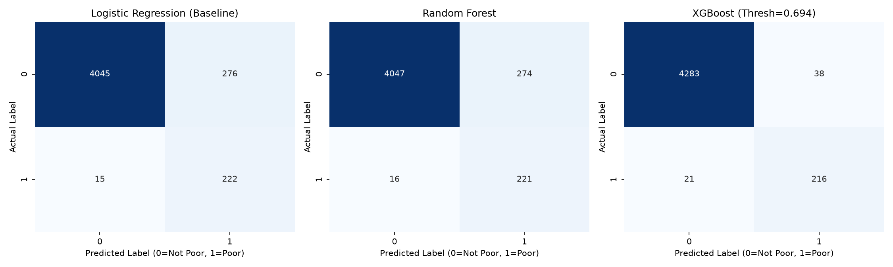
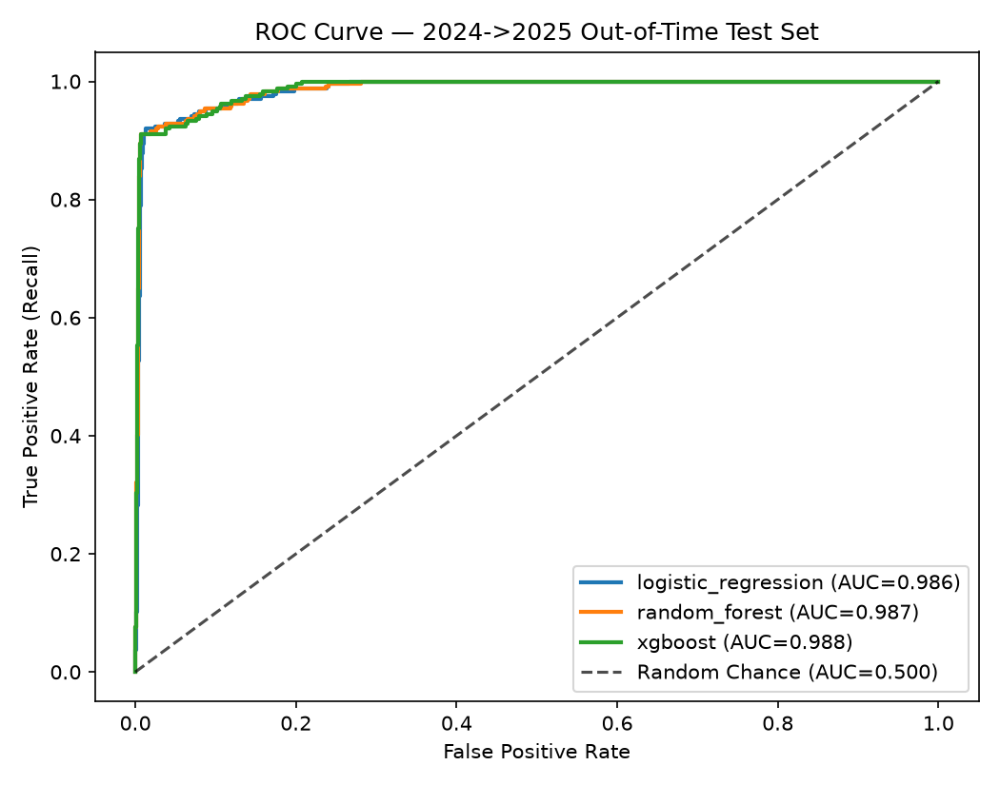
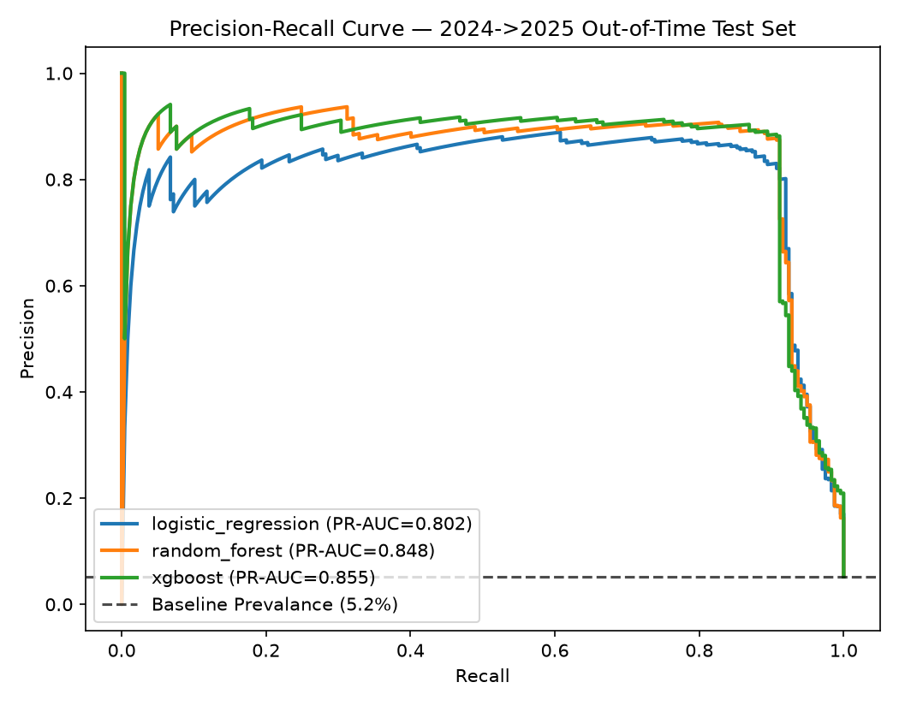
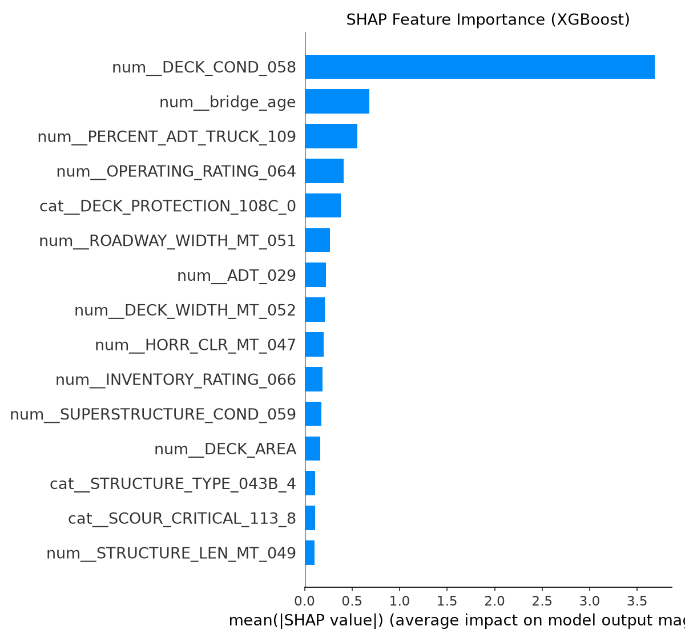
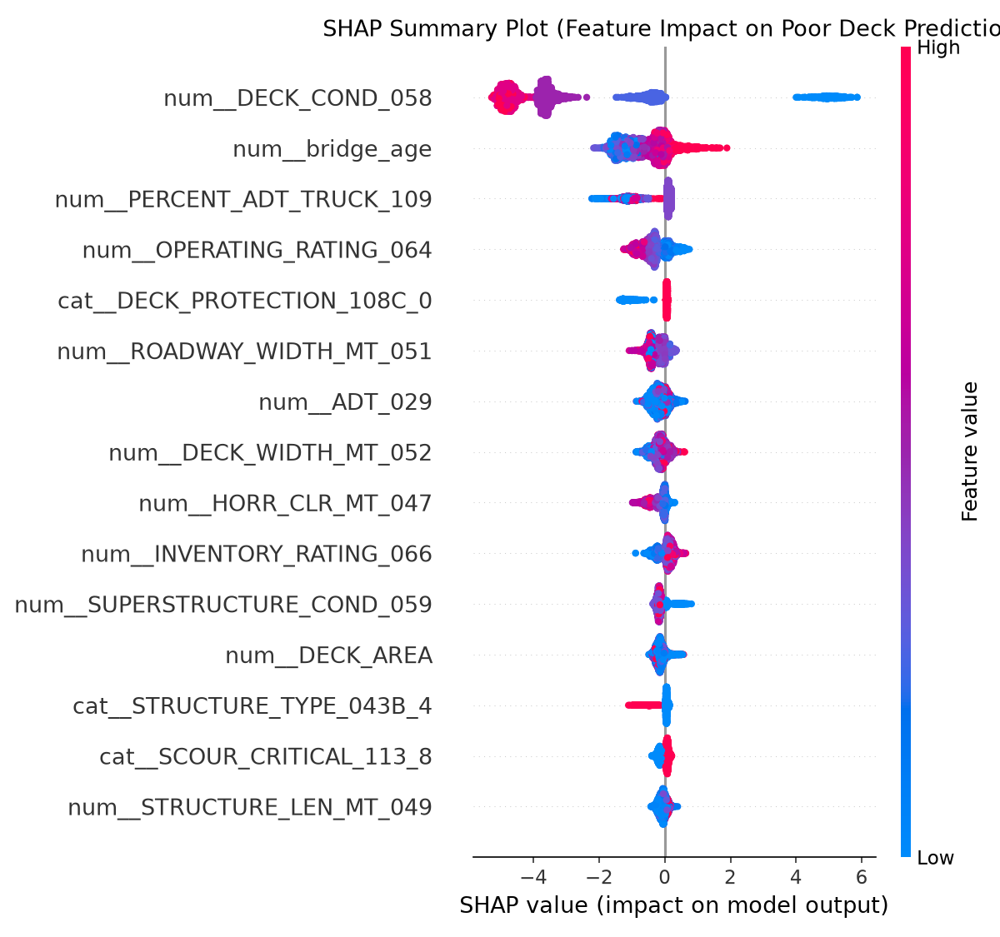
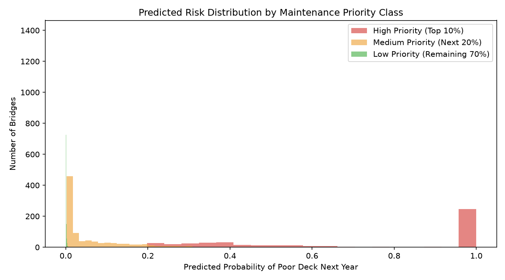
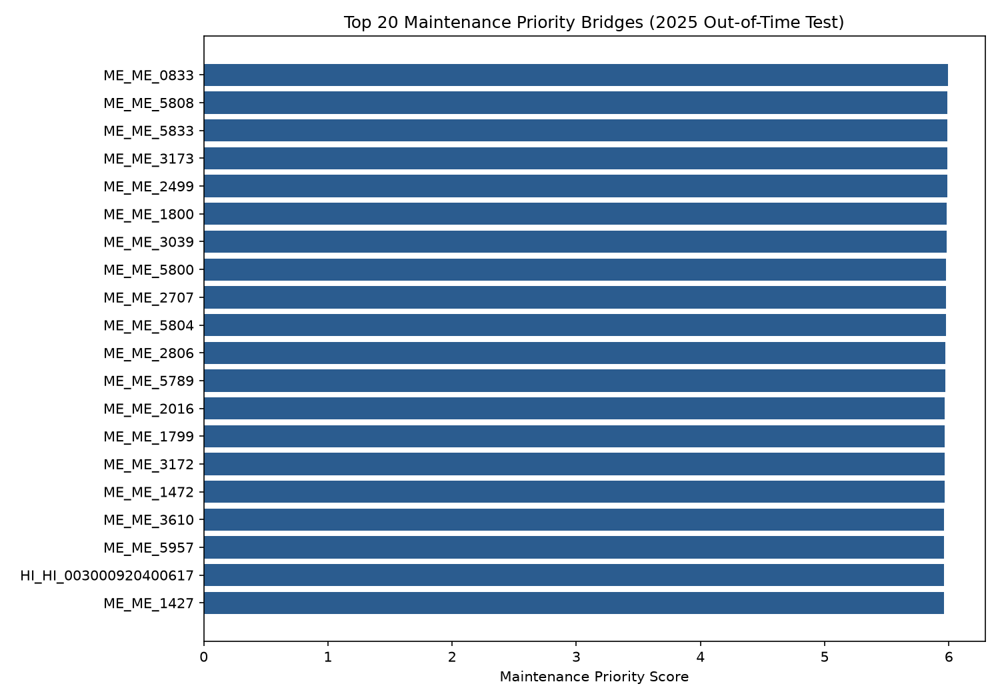

# BridgeRisk

One-year-ahead highway bridge deck deterioration prediction and maintenance prioritization using FHWA National Bridge Inventory (NBI) data, XGBoost, and SHAP.

**Author:** Divyansh Kumar Singh (DKS) · M.Tech Civil Engineering (Hydraulic), IIT Kanpur  
**GitHub:** [DKS-MANAGER](https://github.com/DKS-MANAGER)

---

## Problem

Highway bridge decks deteriorate over time under thermal cycling, moisture, de-icing salts, and heavy commercial vehicle axle loads. State Departments of Transportation (DOTs) conduct biennial bridge inspections rating deck condition on a 0–9 integer scale (FHWA NBI Item 58). Decks rated **$\le 4$** are officially categorized as **Poor** (structurally deficient, requiring structural rehabilitation, load restrictions, or deck replacement).

Predicting which bridges will deteriorate into Poor condition *one year in advance* allows transportation agencies to shift from reactive emergency repairs to planned, cost-effective preventative maintenance.

---

## Approach

```
NBI Inspection Data (2021–2025)
  ├── Clean & standardize field formats
  ├── Compute engineering features (bridge age, truck volume, load ratings)
  └── Link consecutive inspection cycles
       │
       ▼
Chronological Train/Test Partitioning
  ├── Training Transitions: 2021→2022, 2022→2023, 2023→2024 (13,618 records)
  └── Out-of-Time Test Set: 2024→2025 (4,558 bridges)
       │
       ▼
Machine Learning & Validation
  ├── Majority Baseline, Logistic Regression, Random Forest, XGBoost
  ├── Imbalance handling (class weighting & scale_pos_weight)
  └── Recall-oriented decision threshold selection (minimizing missed defects)
       │
       ▼
Explainability & Decision Support
  ├── SHAP feature attribution (global drivers & individual bridge waterfall plots)
  └── Multi-attribute Maintenance Prioritization (Risk × Severity × Traffic × Scour)
```

No random cross-validation row-splitting is used for evaluation: bridge condition is time-dependent, so random row splits leak future inspection data into training. Instead, we use a strict **out-of-time evaluation** (training on 2021–2024 transitions, testing on 2024–2025).

---

## Data

The dataset is derived from official Federal Highway Administration (FHWA) National Bridge Inventory (NBI) records across three states representing distinct environmental and operational regimes:
- **Maine (ME):** Severe freeze-thaw cycles, winter road salt application, coastal exposure.
- **Hawaii (HI):** High marine humidity, tropical rain, airborne chloride corrosion.
- **Delaware (DE):** Dense mid-Atlantic freight corridor, heavy commuter traffic.

### Inventory Summary
| Dataset Split | Inspection Transitions | Bridge Records | Poor Decks Next Year | Positive Rate |
|:---|:---:|---:|---:|---:|
| **Training Set** | 2021→2022, 2022→2023, 2023→2024 | 13,618 | 712 | 5.23% |
| **Testing Set** | 2024→2025 (Out-of-Time) | 4,558 | 237 | 5.20% |

---

## Features

We extract 27 engineering variables from NBI records across structural, operational, and environmental categories:

- **Condition Ratings (Current Year):** Deck (`DECK_COND_058`), Superstructure (`SUPERSTRUCTURE_COND_059`), Substructure (`SUBSTRUCTURE_COND_060`).
- **Age & Geometry:** `bridge_age` (Inspection Year − Year Built), Length (`STRUCTURE_LEN_MT_049`), Maximum Span (`MAX_SPAN_LEN_MT_048`), Deck Width (`DECK_WIDTH_MT_052`), Number of Spans (`MAIN_UNIT_SPANS_045`), Deck Area.
- **Traffic Demands:** Average Daily Traffic (`ADT_029`), Truck Percentage (`PERCENT_ADT_TRUCK_109`).
- **Load Capacity:** Operating Rating (`OPERATING_RATING_064`), Inventory Rating (`INVENTORY_RATING_066`).
- **Material & Design:** Structure Kind (`STRUCTURE_KIND_043A`), Structure Type (`STRUCTURE_TYPE_043B`), Deck Structure (`DECK_STRUCTURE_TYPE_107`), Wearing Surface (`SURFACE_TYPE_108A`), Deck Protection (`DECK_PROTECTION_108C`).
- **Environmental & Foundation Risk:** Scour Criticality (`SCOUR_CRITICAL_113`), Waterway Adequacy (`WATERWAY_EVAL_071`).

*See [`docs/data_dictionary.md`](docs/data_dictionary.md) for full field definitions and FHWA coding guides.*

---

## Model

We compare four models trained with identical preprocessor pipelines (median imputation + standard scaling for numerical features; most-frequent imputation + one-hot encoding for categorical features):
1. **Majority Baseline:** Predicts the non-poor majority class (0).
2. **Logistic Regression:** Linear baseline with balanced class weights.
3. **Random Forest:** Non-linear ensemble (300 trees, max depth 10, balanced class weights).
4. **XGBoost:** Extreme Gradient Boosting (300 estimators, max depth 4, learning rate 0.05, `scale_pos_weight` tuned to class imbalance).

---

## Results

Performance evaluated on the **2024→2025 out-of-time test set** (4,558 unseen bridges):

| Model | Accuracy | Precision | Recall | F1-Score | ROC-AUC | PR-AUC | False Negatives | FNR |
|:---|:---:|:---:|:---:|:---:|:---:|:---:|:---:|:---:|
| Majority Baseline | 0.948 | 0.000 | 0.000 | 0.000 | 0.500 | 0.052 | 237 | 100.0% |
| Logistic Regression | 0.936 | 0.446 | **0.937** | 0.604 | 0.986 | 0.802 | **15** | **6.3%** |
| Random Forest | 0.936 | 0.446 | 0.932 | 0.604 | 0.987 | 0.848 | 16 | 6.8% |
| **XGBoost** (threshold = 0.694) | **0.987** | **0.850** | 0.911 | **0.880** | **0.988** | **0.855** | 21 | 8.9% |

*Source: `reports/model_metrics.csv`*

### Confusion Matrix (Out-of-Time Test Set: 4,558 Bridges)


- Out of 237 bridges that actually deteriorated to Poor condition in 2025, XGBoost correctly identified **216 (91.1% recall)** while missing only 21.
- Unlike baseline models that produced over 270 false alarms to achieve high recall, XGBoost maintained **85.0% precision** (only 38 false positives).

### Discrimination Curves
| ROC Curve (ROC-AUC: 0.988) | Precision-Recall Curve (PR-AUC: 0.855) |
|:---:|:---:|
|  |  |

---

## Explainability

Using TreeSHAP, we interpret model predictions globally across the inventory and locally for individual bridges.

| Mean \|SHAP\| Feature Importance | SHAP Summary Beeswarm Plot |
|:---:|:---:|
|  |  |

### Key Physical & Operational Drivers
1. **Current Deck Condition (`DECK_COND_058`):** Decks currently rated 5 (Fair) are much more likely to cross the threshold into Poor ($\le 4$) within one year than decks rated 6 or above.
2. **Bridge Age:** Older structures exhibit higher deterioration rates due to cumulative fatigue and chloride penetration.
3. **Truck Traffic Percentage (`PERCENT_ADT_TRUCK_109`):** Heavy axle passes accelerate fatigue cracking and surface delamination.
4. **Operating Load Rating (`OPERATING_RATING_064`):** Bridges with reduced load ratings correlate strongly with active structural deterioration.
5. **Deck Protection System (`DECK_PROTECTION_108C`):** Decks with protective membranes or epoxy-coated rebar resist de-icing salt penetration more effectively.

---

## Maintenance Prioritization

Raw failure probabilities alone do not account for structural consequence or traffic disruption. We compute a composite **Priority Score**:

$$\text{Priority Score} = P(\text{Poor}) \times M_{\text{condition}} \times M_{\text{traffic}} \times M_{\text{scour}}$$

Where:
- **$M_{\text{condition}}$:** 3.0 for Poor ($\le 4$), 2.0 for Fair (5–6), 1.0 for Good ($\ge 7$).
- **$M_{\text{traffic}}$:** 2.0 for ADT $> 10,000$, 1.5 for $1,000 \le \text{ADT} \le 10,000$, 1.0 for $\text{ADT} < 1,000$.
- **$M_{\text{scour}}$:** 2.0 for scour-critical bridges (NBI Item 113 in 1, 2, T), 1.0 otherwise.

| Predicted Risk by Priority Class | Top 20 Priority Bridges (2025) |
|:---:|:---:|
|  |  |

### Resource Allocation Summary (4,558 Bridges)
- **High Priority (Top 10% = 456 bridges):** Candidate list for immediate in-depth structural inspection and maintenance budgeting.
- **Medium Priority (Next 20% = 912 bridges):** Candidate list for enhanced monitoring and preventative sealing.
- **Low Priority (Remaining 70% = 3,190 bridges):** Standard biennial inspection cycle.

*Full ranked bridge list exported to [`reports/maintenance_priority_2025.csv`](reports/maintenance_priority_2025.csv).*

---

## Limitations

1. **Subjective Condition Ratings:** NBI condition ratings (0–9) represent visual inspector assessments rather than continuous physical sensor measurements (such as concrete resistivity, ultrasonic pulse velocity, or half-cell corrosion potential).
2. **One-Year Horizon:** The model predicts transitions over a single year; it does not forecast multi-year continuous degradation curves or time-to-rehabilitation.
3. **Unrecorded Interventions:** Bridges that received unrecorded localized maintenance or patch repairs between official inspections may introduce label noise.
4. **Engineering Support Tool:** Predictions are intended to prioritize maintenance funding and direct inspection resources, not to override certified professional bridge engineer judgment.

---

## Project Structure

```text
BridgeRisk/
├── README.md                      # Project overview, methodology, and results
├── requirements.txt               # Python dependencies
├── environment.yml                # Conda environment specification
├── .gitignore                     # Repository git ignore rules
├── data/
│   ├── README.md                  # Data source documentation
│   └── processed/
│       ├── train_2021_2024.parquet # Multi-year training transitions (13,618 records)
│       └── test_2024_2025.parquet  # Out-of-time test set (4,558 bridges)
├── src/
│   ├── download_data.py           # Automated FHWA NBI download utility
│   ├── inspect_data.py            # Inventory inspection and duplicate verification
│   ├── prepare_data.py            # Data cleaning, feature creation, and chronological linking
│   ├── train_models.py            # Trains Baseline, Random Forest, and XGBoost models
│   ├── evaluate_models.py         # Out-of-time evaluation and performance visualization
│   ├── explain_model.py           # SHAP global and local feature explanations
│   └── prioritize_bridges.py      # Multi-attribute maintenance priority ranking
├── notebooks/
│   └── bridge_risk_analysis.ipynb # Interactive exploratory analysis notebook
├── figures/                       # Generated evaluation plots and SHAP charts
└── reports/                       # Metrics CSVs, predictions, and priority rankings
```

---

## Running the Project

### 1. Setup Environment
```bash
# Using pip
pip install -r requirements.txt

# Or using conda
conda env create -f environment.yml
conda activate bridge_condition_xgboost
```

### 2. Run Complete Pipeline
The preprocessed parquet files are already included in `data/processed/`, so you can run training and evaluation immediately:

```bash
# Inspect data inventory
python src/inspect_data.py

# Train models (outputs saved to models/)
python src/train_models.py

# Evaluate on 2024->2025 test set (outputs saved to reports/ and figures/)
python src/evaluate_models.py

# Generate SHAP explanations
python src/explain_model.py

# Generate maintenance priority ranking
python src/prioritize_bridges.py
```

To re-download raw FHWA NBI data and re-process from scratch:
```bash
python src/download_data.py
python src/prepare_data.py
```
