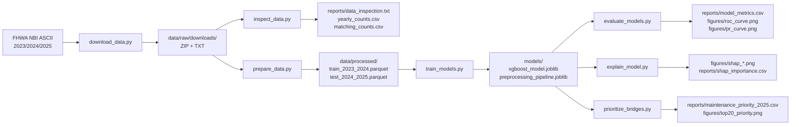
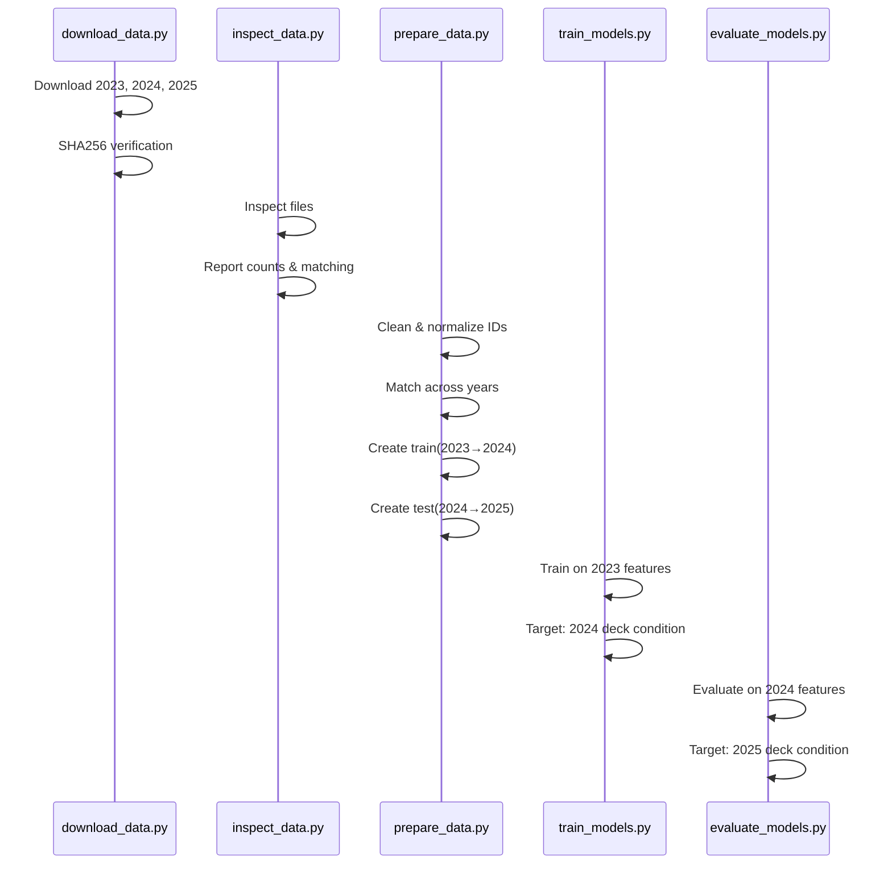
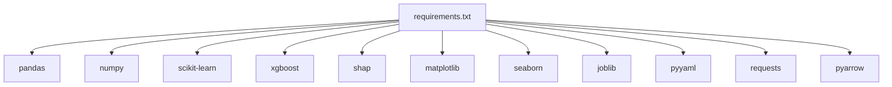
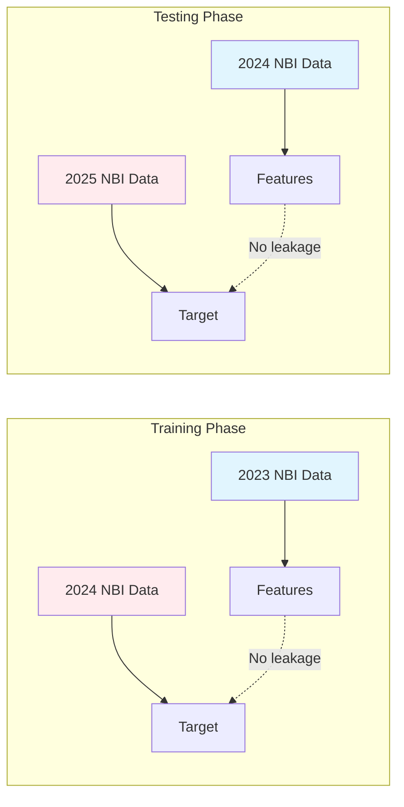

# Architecture & System Design

**Author:** Divyansh Kumar Singh (DKS) · M.Tech Civil Engineering (Hydraulic), IIT Kanpur  
**GitHub:** [DKS-MANAGER](https://github.com/DKS-MANAGER)

## Mission Statement
One-year-ahead bridge deck condition prediction and maintenance prioritization using explainable XGBoost on official FHWA NBI data.

## Quick Navigation

| Path | Purpose |
|------|---------|
| `src/download_data.py` | Download and extract FHWA NBI data |
| `src/inspect_data.py` | Inspect raw data and report statistics |
| `src/prepare_data.py` | Clean, match, and create train/test splits |
| `src/train_models.py` | Train LR, RF, and XGBoost models |
| `src/evaluate_models.py` | Evaluate models and generate metrics |
| `src/explain_model.py` | SHAP explanations and plots |
| `src/prioritize_bridges.py` | Maintenance priority scoring |
| `configs/priority_config.yaml` | Priority multiplier configuration |
| `models/` | Serialized models and preprocessor |
| `reports/` | Metrics, predictions, and validation reports |
| `figures/` | ROC, PR, confusion matrix, SHAP plots |

## Directory Topology

```
bridge_condition_xgboost/
├── .github/
│   ├── workflows/
│   │   └── ci.yml                 # CI/CD pipeline
│   ├── ISSUE_TEMPLATE/
│   │   ├── bug_report.md          # Bug report template
│   │   └── feature_request.md     # Feature request template
│   └── pull_request_template.md   # PR template
├── configs/
│   └── priority_config.yaml       # Maintenance priority multipliers
├── data/
│   ├── raw/
│   │   ├── downloads/             # Original ZIP/TXT files (gitignored)
│   │   └── extracted/             # Extracted raw text files (gitignored)
│   └── processed/                 # Train/test Parquet files
├── docs/
│   ├── architecture.md            # This file
│   ├── data_dictionary.md         # NBI field definitions
│   ├── data_selection.md          # State selection rationale
│   ├── limitations.md             # Project limitations
│   └── methodology.md             # Technical methodology
├── figures/                       # PNG plots and visualizations
├── models/                        # Serialized models (gitignored)
├── notebooks/                     # Jupyter notebooks (optional)
├── reports/                       # CSV/TXT reports and metrics
├── src/
│   ├── download_data.py           # Entry point: data acquisition
│   ├── inspect_data.py            # Entry point: data inspection
│   ├── prepare_data.py            # Entry point: data preparation
│   ├── train_models.py            # Entry point: model training
│   ├── evaluate_models.py         # Entry point: model evaluation
│   ├── explain_model.py           # Entry point: SHAP analysis
│   └── prioritize_bridges.py      # Entry point: maintenance ranking
├── CITATION.cff                   # Citation metadata
├── CONTRIBUTING.md                # Contribution guidelines
├── environment.yml                # Conda environment spec
├── requirements.txt               # Pip dependencies
├── .gitignore                     # Git ignore rules
└── README.md                      # Project overview
```

## Data Flow Architecture



## Component Boundaries

| Component | Input | Output | Mutates |
|-----------|-------|--------|---------|
| `download_data.py` | FHWA URLs | `data/raw/` | Downloads files |
| `inspect_data.py` | `data/raw/extracted/` | `reports/` | Read-only |
| `prepare_data.py` | `data/raw/extracted/` | `data/processed/` | Creates Parquet |
| `train_models.py` | `data/processed/` | `models/` | Serializes models |
| `evaluate_models.py` | `models/`, `data/processed/` | `reports/`, `figures/` | Generates outputs |
| `explain_model.py` | `models/`, `data/processed/` | `figures/`, `reports/` | Generates outputs |
| `prioritize_bridges.py` | `models/`, `data/processed/` | `reports/`, `figures/` | Generates outputs |

## State Management

- **Raw data:** Immutable after download. Checksums (SHA256) verified.
- **Processed data:** Versioned by year. Train = 2023→2024, Test = 2024→2025.
- **Models:** Immutable after training. Saved with `joblib` + JSON parameters.
- **Reports:** Reproducible from raw data + model version.

## Temporal Integrity



## Dependency Graph



## Data Leakage Boundaries



## Reproducibility Checklist

- [ ] `environment.yml` or `requirements.txt` installed
- [ ] `src/download_data.py` executed (or raw files placed in `data/raw/`)
- [ ] `src/inspect_data.py` executed
- [ ] `src/prepare_data.py` executed
- [ ] `src/train_models.py` executed
- [ ] `src/evaluate_models.py` executed
- [ ] `src/explain_model.py` executed
- [ ] `src/prioritize_bridges.py` executed
- [ ] All checks in `reports/pipeline_validation.txt` show `[PASS]`
